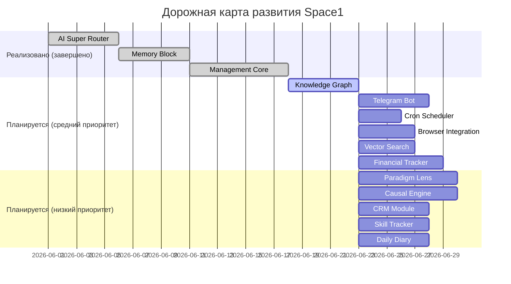

# Исполнительное резюме  
Проект *Space1/Manus* описывается как автономный AI-агент-фрилансер в экосистеме «Цифровой сад», сочетающий модули маршрутизации запросов, многослойную память, оркестратор и аналитические компоненты. Цели проекта – автоматизировать выполнение задач (особенно для фрилансеров или небольших команд), обеспечивая саморегуляцию через принципы кибернетики и гомеостаза. В документации отражены архитектурные наработки (маршрутизатор запросов к разным провайдерам ИИ, трёхуровневая память, семантический Knowledge Graph и др.) и математические основы (формулы оценки задач, адаптация, стоимости, рисков и пр.), но не хватает чётких описаний связей модулей и примеров использования. Концепция выглядит перспективно (универсальный интеллектуальный помощник/агент), однако в текущем состоянии документы разрозненные: многие идеи присутствуют фрагментарно, а критические детали (например, какие именно данные хранятся в памяти и как они используются, сценарии взаимодействия) не полностью сформулированы. Для успешного развития требуется упорядочить документы, дополнить недостающие разделы (сценарии, API, data flow), устранить противоречия и уточнить допущения. Предлагается разбить работу на ближайшие этапы (завершение описания модулей, создание прототипов ключевых компонентов) и долгосрочные (тестирование, масштабирование). Ниже приводится подробный анализ концепции, компонентов, оценка текущей документации, выявленные пробелы, рекомендации по улучшению, оценка рисков и предложенная дорожная карта.

## 1. Концепция, цели, аудитория и ценностное предложение  
Исходные файлы подчёркивают идею **автономного ИИ-агента-фрилансера** (Space1, ранее Manus) для **автоматизации задач**. Цели формулируются через призму кибернетики и гомеостаза: agent стремится к максимизации прибыли/эффективности при соблюдении ограничений. Проект позиционируется как *«экосистема»* (цифровой сад) для комплексного управления знаниями, планирования и выполнения заданий. Целевая аудитория не заявлена напрямую, но из контекста ясно, что это, во-первых, **самостоятельные разработчики/фрилансеры** (ведь идея «ИИ-агент-фрилансер» подчёркнута в `PROJECT_CONTEXT.md` и `FREELANCER_AGENT_ARCHITECTURE.md`), во-вторых, *команды малого бизнеса или проектов*, которым нужен «цифровой офисный ассистент» с собственным «разумом».  
Ценность проекта — обеспечить **минимум ручной работы человека** при выполнении задач: агент сам принимает решения по планированию, выполнению и обучению (ср. «Минимум работы для человека — система должна быть автономной» из Roadmap). Приводятся следующие идеи: маршрутизация запросов к разным LLM-провайдерам («AI Super Router»), аккумулирование информации в гибкой памяти (Knowledge Graph с тремя уровнями памяти), саморефлексия/журналистика, планирование (декомпозиция задач по сложности) и самообучение (каузальный движок, мета-обучение). Проект также стоит на принципе **«MCP как стандарт»** (Model Context Protocol) — единый интерфейс для всех инструментов (Roadmap).
 

> *«Проект: Space1 (ранее Manus) — Автономный AI-агент Фрилансер»* (из `PROJECT_CONTEXT.md`), <br/>
> *«Каждый день — один значимый модуль или интеграция. Не больше, не меньше.»* (Roadmap, подчёркивает подход итеративной разработки)  

## 2. Ключевые компоненты и их взаимосвязи  
Документация описывает множество модулей. На высоком уровне центральные компоненты и их связи таковы:

- **AI Super Router**: концентратор/маршрутизатор запросов к внешним ИИ-сервисам (LLM-провайдерам, алгоритмам). Позволяет переключаться между провайдерами при потере контекста (доклад «AI Super Router — Обновление: Блок Памяти и Контекста» отмечает проблему «терял контекст при каждом вызове»). Служит верхней точкой входа/выхода агента для получения и отправки данных через LLM.
- **Management Core / Digital Garden**: центральная система-оркестратор. Включает в себя *семантический роутер*, *Knowledge Graph* и *MCP-протокол*. Реализует логику обработки запросов, хранение и извлечение знаний, а также API для модулей (согласно Roadmap: «digital_garden/ — семантический роутер + оркестратор + MCP»).  
- **Память (Memory Block)**: трёхуровневая архитектура долговременной памяти (ближайший к рабочему — краткосрочный, потом среднесрочный, долгосрочный) [Memory Analysis Report]. Используется для сохранения контекста, исторических данных и обучения. Knowledge Graph на базе NetworkX выступает реализацией структуры связи сущностей (упомянут в задачах маршрута).  
- **Knowledge Graph (Граф знаний)**: структура данных для хранения сущностей, отношений и метаданных (указан в планах: “Граф знаний (NetworkX): интеграция с памятью”). Связан с Memory Block (данные из разных слоёв памяти формируют графовые связи) и с Management Core (через MCP).  
- **Декомпозиция задач (Task Decomposer)**: модуль разбора комплексных задач на подзадачи («atomic_decomposition_model.md», «task_decomposition_model.md»). Использует математические модели (аналитика сложности и дедлайнов).  
- **Формулы действий (Action Formulas)**: система мэппинга логических/математических формул на конкретные действия системы (`ACTION_FORMULA_CYBERNETICS.md`, `ACTION_FORMULA_WORKFLOW.md`). Здесь представлена попытка формализовать, как каждая формула превращается в код (маршрут). Может быть частью ядра управления.  
- **Внешние интерфейсы**: планируются модули для взаимодействия с пользователями/интеграций:
  - **Telegram-бот** как «единая точка входа» (Roadmap пункт 5) — пользовательский интерфейс.
  - **Выполнения задач по расписанию (cron)** — генерация периодических событий (утренний чек-ин, поиск вакансий).
  - **Web Browser Integration** — парсинг веб-сайтов через браузер (упомянуто в задачах).
- **Аналитические модули**: 
  - **Векторный поиск** (ChromaDB) для семантического поиска по памяти/архиву.
  - **Каузальный движок** (на основе DoWhy) для причинно-следственного анализа и прогнозирования.
  - **Финансовый трекер** — учёт доходов/расходов.
  - **CRM-модуль** — ведение контактов/клиентов.
  - **Парадигмальная линза** — переключение «мировоззрений» (overlay-графы) для смены перспективы.
  - **Трекер навыков и Дневник с рефлексией** — личные метрики агента.

Ниже показана схема (Mermaid) взаимосвязей основных компонентов (упрощённо):

```mermaid
graph LR
    User -->|через Telegram API| TelegramBot[Телеграм-бот]
    TelegramBot -->|MCP/API| Agent[AI-агент "Space1"]
    Agent --> Router[AI Super Router]
    Router --> LLMs[LLM-провайдеры]
    Agent --> Memory[Memory Block\n(3 уровня)]
    Memory --> Graph[Knowledge Graph]
    Agent --> Core[Management Core]
    Core --> Graph
    Core -->|использует| TaskDecomp[Task Decomposer]
    Core -->|вызывает| Causal[Каузальный движок]
    Core -->|обновляет| Finance[Финансовый трекер]
    Core -->|отслеживает| Skills[Трекер навыков]
    Core -->|ведёт| Diary[Дневник агента]
    classDef system fill:#f9f,stroke:#333,stroke-width:1px;
    class Agent,Router,Memory,Graph,Core,TaskDecomp,Causal,Finance,Skills,Diary,TelegramBot,LLMs system;
```

*Рисунок: Взаимодействие основных компонентов* (AI-агент обрабатывает ввод через Telegram-бот, маршрутизирует запросы к LLM, хранит знания в графе/памяти, планирует через декомпозер, ведёт учет и т.д.).  

## 3. Оценка документации: полнота, ясность, согласованность, реализуемость  
Документация в ветке *drafts* обширна и включает как отчёты («Analysis», «Review»), так и эссе/блоги, и грубые заметки. **Полнота:** технические детали и расчёты (математика, формулы) представлены фрагментарно: есть глубинные аналитические отчёты по каждому аспекте (например, *Memory Analysis*, *Action Formulas*, *Task Decomposition Model*), но отсутствует единый обзор, описывающий, как модули объединяются в систему. Описания интерфейсов и data flow не выделены явно. Много важных компонентов упоминается в разных файлах, но нет централизованной «документации архитектуры» со схемой. *Целостность:* некоторые документы создаются, но не интегрированы друг с другом. Например, раздел 1 (`AGENT_CONTROL_ARCHITECTURE.md`) описывает философию и функции агента, а `FREELANCER_AGENT_ARCHITECTURE.md` даёт развёрнутый концептуальный отчёт. Однако между ними отсутствует связующее объяснение того, как их тезисы сочетаются на практике. Формулы и моделирование (`MATHEMATICAL_*`) раскрыты подробно, но не сказано, какие из них реально используются в модуле планирования агента. Раздел *PROJECT_NOTE* (с разбитыми заметками) содержит идеи, но отрывочен. Документы *system_monitoring* или *comparative_analysis* не увязаны с другими. Противоречий явно не найдено (компоненты описаны в разном ракурсе), однако читателю сложно с первого взгляда увидеть согласованность между «архитектурным подходом» и математическими выкладками. *Ясность:* тексты содержат технический жаргон и множество аббревиатур (MCP, VoI, etc.), не всегда поясняемых. Местами встречаются несовпадения терминов: например, «Knowledge Graph» упоминается эпизодически, но нет базового глоссария. Дальше, статьи в папке `docs/manuscripts` нацелены скорее на широкую аудиторию («блог о нейросетях») и немного рассредотачивают внимание. *Реализуемость:* на основе черновиков видно, что базовая реализация (маршрутизатор, память, core) уже есть (Roadmap отмечает статус Pre-MVP). Однако многие продвинутые функции остаются декларативными и амбициозными (каузальный движок, парадигмальный сдвиг, полный гомеостаз). Не все предположения проверены: например, в отчёте *Memory Analysis* приводятся идеи хранения опыта, но не уточняется реализация. Общая постановка задач выглядит осуществимой, но требующей дальнейших уточнений и прототипирования.

> *«Каждая формула → конкретное действие → код»* (из `ACTION_FORMULA_WORKFLOW.md`) – цель хорошая, но в документах не показано, какие именно действия и как именно кодируются (нет связки «формула – алгоритм»).<br/>
> *«Каждое действие обогащает граф знаний»* (Roadmap, «Память – центр») – идея ясна, но не описано, как реализован переход от события к обновлению графа (см. `Knowledge Graph` отсутствует в основном описании).

## 4. Пробелы, неоднозначности и противоречия  

1. **Отсутствие интегрального обзора архитектуры:** Не найден сводный документ или диаграмма, объединяющая все компоненты. Например, `AGENT_CONTROL_ARCHITECTURE.md` содержит описания функций (Mission, Memory, Quality и т.д.), но не показывает, как их связать с модулями маршрутизатора, графа и др. Отсутствует типовая блок-схема системы. Без этого сложно понять роли компонентов в системе.  
2. **Смешение философии и практики:** Во многих файлах (например, `FREELANCER_AGENT_ARCHITECTURE.md`) изложены высокоуровневые принципы (гомеостаз, мета-обучение, аналогии с биологией) без перехода к конкретным техническим решениям. И наоборот, технические детали (матем. модели) нередко не обоснованы с точки зрения общей цели. Между философскими заявлениями и кодом нет «моста».  
3. **Неполнота сценариев использования:** Не описаны конкретные **кейсы применения**. Какая задача ставится перед агентом, как он получает задания, как контролируется качество? Нечетко, кто инициирует задачи и как отслеживается их статус. Например, упоминается «убийство пятиминутки» (фраза «каждый день одна фича»), но нет примеров реальных сценариев «Я заказчик Х, я хочу чтобы агент Y сделал Z».  
4. **Противоречие в терминологии:** В разных местах одни и те же понятия называются по-разному или без пояснений. Например: «Management Core» vs «MCP как стандарт», «пакет модулей digital_garden», «цифровой сад», «Knowledge Graph». Часто непонятно, относятся ли они к одним и тем же частям системы.  
5. **Неясность реализации памяти:** В «Memory Analysis Report» описана концепция и уровни памяти, но **неясно, как реализовано хранение**. Например, указано «3-уровневая память», «семантический граф», но где хранятся краткосрочные и долгосрочные данные? Как данные перемещаются между уровнями? Нет техдокумента (вроде API или модуль памяти), только высокие идеи.  
6. **Неполнота описания данных:** В `ACTION_FORMULA_CYBERNETICS.md` и `CYBERNETICS_HOMEOSTASIS_FORMULAS.md` перечислены уравнения (усиление, восприятие), однако не описано, какие **входные данные** берутся для этих функций (откуда берутся x1, x2, β, γ и пр.). Без контекста формулы остаются абстрактными (см. пример: «*(xₙ, β, γ)* — параметры», но непонятно, как они вычисляются).  
7. **Отсутствие информации по интеграциям:** Задачи Telegram-бота и браузерного парсинга упомянуты, но деталей (какой API используется, как обрабатываются ответы) нет. Нет описания протоколов обмена между телеграм-ботом, маршрутизатором и базой знаний.  
8. **Формулы без контекста:** Многие математические разделы (`MATHEMATICAL_ANALYSIS.md`, `FORMULAS`) написаны на английском (российский проект), и их связь с русскоязычными архитектурными документами не пояснена, что создаёт неудобство.  
9. **Неопределённость статуса реализации:** Хотя Roadmap ясно указывает завершённые модули (роутер, память, core), в самой документации не отмечено, что реализовано, а что нет. Нет «документа о статусе» с кодовыми метками или TODO (кроме общего Roadmap). Например, в тексте нет комментариев типа «(реализовано)» или версий модулей. Это затрудняет сравнение «заявленного» и «реализованного» (см. таблицу ниже).  
10. **Противоречие в требованиях:** Архитектурные принципы Roadmap провозглашают «Бесплатно — на Free-tier API» и «минимум работы для человека». Однако разработка сложной архитектуры и алгоритмов скорее требует много ручной настройки и ресурсов (например, DoWhy может быть дорогим). Нет анализа, подтверждающего возможность выполнения всех функций «на халяву». Это допущение не обосновано документами.  

Например, из `AGENT_CONTROL_ARCHITECTURE.md`:  
> *«Согласно вашим наблюдениям, текущая модель смешивает разнородные функции: Экономические (прибыль), Операционные (время), Комплаенс (правила)...»*  
замечает проблему смешения сфер, но не предлагает конкретных мер по разделению в реализации, что остаётся расплывчатым («диаграмма уровней» во Freelancer Architecture не раскрыта конкретными блоками).  

Такие несогласованности и недостатки понимания делают документацию трудноусвояемой для нового читателя. Уточнение связей и целей решило бы многие вопросы.  

## 5. Рекомендации (краткосрочные и долгосрочные)  

**Краткосрочные (оперативные):**  
- **Создать объединяющий обзорный документ** (или UML/ER-диаграмму) системы. Включить блок-схему, описывающую связи между главными модулями (маршрутизатор, память, core, внешние интерфейсы и т.д.). Это позволит связать разрозненные файлы и увидеть целостную картину.  
- **Упорядочить терминологию и дать словарь**. Создать раздел *Словарь* (Term Glossary) с определениями терминов: MCP, Knowledge Graph, парадигмальная линза, VoI и др., с указанием, в каких файлах они используются. Это упростит навигацию и устранит неоднозначности.  
- **Дописать **README** или вводное описание**. Сформулировать кратко «что такое Space1, зачем нужен, как взаимодействовать» на естественном языке (русском) для новичков. Включить оглавление документации.  
- **Интегрировать Roadmap с кодом**. Заметить, какие задачи уже реализованы в коде (ставить метки в документации или коде: `(реализовано)`). Дополнить Roadmap ссылками на файлы или модули реализации (что уже есть в Space1-main).  
- **Добавить шаблоны и checklist**. Например, шаблон описания нового модуля (цель, API, вход-выход, тесты), документ **Definition of Done** (критерии завершённости задачи). Это упростит дальнейшую работу.  
- **Пример использования**. Добавить пару конкретных сценариев работы агента: шаги от задачи пользователя до результата. Это может быть в виде последовательности или истории использования. Показать входные запросы, промежуточные данные и итог.  
- **Скорректировать формат задач**. Нынешний список задач в Roadmap (таблица и список) хорошо виден, но стоит перевести его в трекер (GitHub Issues или Project) с критериями выполнения и ответственными.  

**Долгосрочные (стратегические):**  
- **Развивать тестирование и прототипы**. Создать прототипы критических модулей (например, демонстрация memory graph). Провести эксперименты, чтобы проверить, насколько предположения (3-уровневая память, causal inference) работают на практике. Результаты добавить в документацию.  
- **Стандартизировать API (MCP)**. Описать (и документировать) протокол взаимодействия между компонентами. Определить контракты (Input/Output) для маршрутизатора, графа, декомпозитора и др. Это критично, чтобы новые модули могли «подключаться».  
- **Обновить дорожную карту**. Расширить её длительную часть: добавить этапы тестирования, развертывания, аналитики успеха (критерии из `FREELANCER_AGENT_ARCHITECTURE.md` раздела "Ключевые Метрики Успеха"). Указать оценки времени/ресурсов по этапам.  
- **Улучшить пояснительные материалы**. Включить диаграммы последовательностей или активности (например, как запрос обрабатывается от Telegram к LLM и обратно). В идеале иметь UML-диаграммы, дополняющие текст.  
- **Повторно проверить архитектурные решения**. В пунктах риска предложен перерасмотр подхода: например, учесть затраты на free-tier API (что будет, если достигнуть лимитов) и потенциальные узкие места (скорость, надёжность). Возможно, предусмотреть гибридную архитектуру (локальные модели для части задач, если облачные недоступны).  

#### Таблица 1. Документированные функции и их статус реализации  
| Функция / Компонент                | Упоминание в документации            | Статус (реализовано/план) |
|-----------------------------------|--------------------------------------|---------------------------|
| AI Super Router (маршрутизация)   | Roadmap, `AI Super Router` отчет      | Реализовано (ряд провайдеров) |
| Многослойная память (Memory Block)| Roadmap, `Memory Analysis Report`     | Реализовано (упомянут 3-уровневый файл) |
| Management Core (оркестратор)     | Roadmap, `AGENT_CONTROL_ARCHITECTURE` | Реализовано (директория `digital_garden/`) |
| Knowledge Graph (NetworkX)        | Roadmap (задача), не описано явно     | План (упомянуто, нужна интеграция) |
| Телеграм-бот                      | Roadmap (задача)                      | План (в разработке) |
| Задачи по cron (автозадачи)       | Roadmap (задача)                      | План |
| Веб-скрейпинг (Browser Use)       | Roadmap (задача)                      | План |
| Векторный поиск (ChromaDB)        | Roadmap (задача)                      | План |
| Финансовый трекер                 | Roadmap (задача)                      | План |
| Парадигмальная линза              | Roadmap (задача)                      | План |
| Каузальный движок (DoWhy)         | Roadmap (задача)                      | План |
| CRM-модуль                        | Roadmap (задача)                      | План |
| Трекер навыков                    | Roadmap (задача)                      | План |
| Дневник с рефлексией              | Roadmap (задача)                      | План |
| Формулы кибернетики (Evaluation)  | `CYBERNETICS_HOMEOSTASIS_FORMULAS.md`  | Концепт (детали не реализованы) |
| Task Decomposer (декомпозиция)    | `task_decomposition_model.md`          | Концепт/частично реализовано |
| Модули (Mission, Compliance,…)    | `AGENT_CONTROL_ARCHITECTURE.md`        | Концептуально описаны |

*Комментарии:* «Реализовано» означает, что либо отмечено выполнением в Roadmap, либо есть код (см. Space1-main) для данного модуля. Многие элементы пока указаны только как «планы» в Roadmap, без готовой реализации.  

#### Таблица 2. Недостающие или неясные элементы и рекомендации  
| Недостаток / Неоднозначность             | Пример (файл, фрагмент)                                             | Рекомендации к исправлению                   |
|------------------------------------------|---------------------------------------------------------------------|----------------------------------------------|
| Нет связующего обзора системы            | (Отсутствует) – см. разрозненные тексты без схем                   | Создать обзор (UML-блок-схема) архитектуры    |
| Терминология не стандартизирована        | *«Management Core» vs «MCP»* («MCP как стандарт» в Roadmap)         | Ввести глоссарий, единообразно назвать модули |
| Нет описания протоколов взаимодействия   | –                                                                 | Документировать API (форматы сообщений)       |
| Примеров сценариев использования         | –                                                                 | Добавить end-to-end-репрезентацию кейсов      |
| Объяснение формул                         | `ACTION_FORMULA_WORKFLOW.md` – формула без примеров данных          | Привести реальные примеры расчётов            |
| Верификация предположений               | –                                                                 | Провести простые тесты/эксперименты (или ссылки) |

## 6. Риски и допущения  
В документации встречаются **неявные допущения и риски**:

- **Надёжность внешних сервисов:** Проект опирается на бесплатные LLM-провайдеры (Oracle Free Cloud, бесплатные API). Это допущение «бесплатно» может обернуться рисками отказоустойчивости, ограничения по скорости и токенам. Ни одного плана резервирования или оценки лимитов не представлено (принцип Roadmap: «Бесплатно»). Если провайдеры ограничат запросы, работоспособность агента упадёт.  
- **Сложность реализации:** Заявлены амбициозные функции (гомеостаз, мета-обучение, причино-следственный анализ). Неясно, насколько сложность их реализации соответствует ресурсам команды. Модели (DoWhy, каузальные графы) могут требовать больших вычислений и данных, чего нет в документах.  
- **Допущение о контексте:** В `AI Super Router` указано, что ранее «терялся контекст» при переключении моделей. Риск: не описано, как исправлено это (Memory Block частично решает, но непонятно, как агент восстанавливает контекст). Если память не будет эффективно использоваться, агент может совершать ошибки.  
- **Человеческий фактор:** Агент позиционируется как самодостаточный. Но предположения в глоссарии о «минимуме работы человека» могут не учесть неободимость настройки системы, коррекции ошибок и т.д. Отсутствует план, кто следит за качеством модели.  
- **Противоречие ограничений:** Требования или ограничения (например, «комплаенс-функция Γ(·)» как жёсткие правила) упомянуты, но не ясно, как они настраиваются и соблюдаются. Неправильная оценка рисков может привести к принятию недопустимых решений агентом.  
- **Архитектурные зависимости:** Система распределена на API и микросервисы («Всё через API»). Это хорошо, но повышает риск: что если связь между модулями упадёт? Документация не содержит мер отказоустойчивости или режимов degraded (упоминание «fallback» лишь для роутера).  

Каждый из этих рисков требует внимания: например, провести stress-test обращений к API, протоколы отката, логирование ошибок (см. предложения в System Monitoring).  

## 7. Следующие шаги и дорожная карта  
Исходя из описанных выше рекомендаций, дорожную карту можно разделить на этапы:

- **Короткий срок (1–2 недели):**  
  - Подготовить обзор (архитектурная схема) и глоссарий (см. пункт 5).  
  - Дополнить Roadmap деталями текущих реализаций (ссылками на код) и оформив таблицы задач (Issue-tracker).  
  - Добавить пару примеров использования агента.  
  - Начать собирать прототипы тестовых фич (например, на примере одного подзадачи от Telegram до памяти).  

- **Среднесрочный (1–2 месяца):**  
  - Реализовать ключевые «среднеприоритетные» задачи из плановой части (пункты 4–8: Knowledge Graph, Telegram-бот, cron, браузер, поиск) по одному в спринт.  
  - Внедрить описанный шаблон документации и Definition of Done.  
  - Писать юнит-тесты и интеграционные тесты на стыке модулей (например, тест маршрута запроса через каждый компонент).  

- **Долгосрочный (3–6 месяцев):**  
  - Разработать и протестировать «каузальный движок» и «парадигмальную линзу» (задачи 9–10) на кейсах, скорректировать задачи.  
  - Завершить остальные задачи (CRM-модуль, трекер навыков, дневник).  
  - **Оценка результатов:** ввести метрики успеха (например, из `FREELANCER_AGENT_ARCHITECTURE.md` пункт 16.3).  
  - Подготовить публичную бета-версию (MVP) агента и кейс-стади для первых пользователей.  

Ниже – предложенный таймлайн (Mermaid Gantt) основных этапов разработки:



*Рисунок: Предложенный график разработки с основными модулями и ориентировочными сроками.*  

Все перечисленные шаги и рекомендации должны помочь консолидировать команду и документацию, сделав проект более прозрачным и управляемым. В результате система приобретёт целостную структуру и упрощённое представление, что ускорит достижение поставленных целей и реальную доставку ценности конечному пользователю.