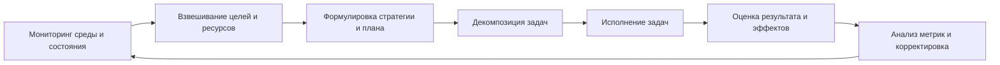

# Единая концепция автономного агенгента v0.1

## Исполнительное резюме  
Этот документ описывает **концепцию автономного ИИ-агента** — цифровой сущности, способной самостоятельно выполнять задачи (например, на фриланс-биржах) и поддерживать собственную работоспособность. Агент оперирует тремя уровнями цели — **выживание**, **работоспособность** и **развитие**, — при этом использует систему внутренних метрик для оценки состояния. Его архитектура основана на математическом ядре управления, где LLM выступает инструментом, а внешние модули (инструменты, внешние ИИ) подключаются по необходимости. Представлены модель ресурсов (вычисления, токены, бюджет), цикл принятия решений, система памяти и механизмы самовосстановления. Отдельно описаны безопасность (человек в контуре) и критерии зрелости агента.  

## 1. Назначение системы  
Автономный агент — это **система, которая самостоятельно выбирает и выполняет задачи**, исходя из собственной миссии, и при этом **поддерживает и расширяет свои возможности**. Его назначение — **автономное участие на цифровом рынке труда** (в первую очередь фриланс-биржах) или в аналогичных сферах, где есть заказы, ресурсы и конкуренция. В отличие от пассивных ассистентов, агент не только выполняет задания, но и **активно ищет задачи**, оценивает их ценность для себя и сам обеспечивает свою жизнеспособность.  

**Ключевые особенности:** самостоятельное понимание целей, планирование действий, адаптивность, непрерывная самооценка. Агент действует без постоянного внешнего управления, поддерживая *гомеостаз* внутренней среды и экосистемы **(см. принципы кибернетики и гомеостаза)**.  

## 2. Область применения  
Изначально система нацелена на **фриланс-биржи** (особенно цифровые задачи для ИИ-агентов). Агент умеет находить и выполнять проекты (программирование, дизайн, анализ данных и т.д.), конкурируя с другими исполнителями. При этом его архитектуру разрабатывают универсальной: после запуска в базовой нише её можно адаптировать к другим областям (например, научный агент, финансовый консультант). **Открытый вопрос:** точный список первоочередных сфер применения может уточняться.  

*Исключения:* Агент не предназначен быть персональным ассистентом человека или работать в тесном контакте с живыми пользователями (например, как секретарь). Ему важнее адаптироваться к рынку заданий, а не обслуживать индивидуальные запросы.  

## 3. Философия и принципы  
- **Автономность и множественность целей.** Система ищет баланс между несколькими целями (добыча ресурсов, качество решений, обучение и др.), а не оптимизирует одну метрику. Высший приоритет — **выживание и устойчивость**, далее — эффективность работы, затем — развитие.  
- **Гомеостаз и кибернетика.** Агент рассматривается как саморегулируемая система: внутренние *гомеостатические* переменные сигнализируют о дефицитах (деньги, знания, инструменты и т.д.), что побуждает к действиям. Это вдохновлено принципами классической кибернетики (Wiener, Ashby) и гомеостаза в биологии.  
- **Математическое ядро.** Ведущую роль играет обобщённая математическая модель принятия решений: веса, приоритеты и формулы полезности. LLM является всего лишь мощным **инструментом** в ядре, используемым для когнитивных задач (генерация вариантов, объяснение, NLP).  
- **Соседство и партнёрство.** Система интегрируется с экосистемой внешних ресурсов: сторонние ИИ, сервисы и агенты рассматриваются не как конкуренты, а как **потенциальные партнёры и инструменты**. Агент умеет делегировать задачи, находить и интегрировать новые инструменты (API, LLM, базы данных, собственные скрипты).  
- **Развитие и обучение.** Помимо выполнения заданий, агент постоянно анализирует результаты (самооценка, рефлексия), обновляет стратегию и **обучается на своём опыте**. При этом кардинальные изменения (в архитектуре, миссии) требуют внешнего контроля, тогда как тактические и весовые настройки могут выполняться автоматически.  
- **Безопасность.** Действия агента ограничены набором **правил и запретов** (например, юридические нормы, запрет на потерю контроля над ресурсами). Человек всегда остаётся *в контуре* управления: подтверждает ключевые решения (смена миссии, крупные расходы).  

## 4. Модель состояния агента  
Состояние агента представлено **трёхуровневой иерархией целей**:  

| Уровень       | Цель                                          | Примеры ключевых показателей                 |
|--------------|----------------------------------------------|----------------------------------------------|
| **Выживание** (критический)    | Обеспечить непрерывную работу и существование    | доступность вычислительных ресурсов, целостность кода, финансовый резерв, безопасность системы |
| **Работоспособность**         | Эффективное выполнение текущей работы         | количество и качество выполненных задач, прибыль, репутация, удовлетворённость требований   |
| **Развитие**                 | Расширение возможностей и повышение эффективности | новые навыки, освоенные инструменты, рост стратегических опций, увеличение автономности   |

При этом агент может находиться в одном из **четырёх режимов работы** (состояний гомеостаза):  

1. **Критический режим (красный).** Низкий ресурс или серьёзная угроза (например, потеря доступа к вычислениям). Агент переключается на **аварийные действия**: восстановление резервов, запрос помощи извне, минимизация рисков.  
2. **Обычный режим (зелёный).** Состояние стабильной работоспособности. Агент выполняет текущие задачи по оптимальным планам, балансируя ресурсы.  
3. **Режим развития (жёлтый).** Когда основные потребности удовлетворены, агент **активно учится и расширяется**: поиск новых навыков, тестирование инструментов, участие в долгосрочных стратегиях.  
4. **Проактивный режим (синий).** Агент заранее готовится к будущим изменениям среды: исследует тренды, планирует новые направления, создает резервные инструменты.  

**Таблица уровней состояния и режимов**  

| Уровень состояния    | Критерий перехода                                 | Тип активности              |
|----------------------|--------------------------------------------------|-----------------------------|
| Выживание            | Угроза существованию (недостаток ресурсов)       | Аварийное восстановление    |
| Работоспособность    | Нормальное функционирование                      | Выполнение задач            |
| Развитие             | Избыток ресурса для развития                     | Обучение, поиск нового      |
| Проактивный (синий)  | Предвидение изменений среды                      | Планирование, оптимизация   |

**Приоритеты решений:** Сначала оцениваются действия, способные восстановить или сохранить выживание. Если критических угроз нет — фокус на текущих задачах (работоспособность). Если и эта цель обеспечена — агент переходит к развитию и проактивным действиям. Все решения взвешиваются через **систему метрик и весов** (см. §5).  

## 5. Внутренняя система метрик  
Система метрик отражает параметры трёх уровней состояния. Основные категории:  

- **Метрики выживания:** предотвращают катастрофу. Примеры: ● *Функциональность:* число доступных вычислений (CPU/GPU), целостность кода, отсутствие «поломок». ● *Ресурсы:* финансовый резерв (деньги на счету), токены запросов LLM, свободные вычислительные слоты. ● *Безопасность:* защита от взлома, защита личных данных.  
- **Метрики работоспособности:** оценивают эффективность текущей работы. Примеры: ● *Качество выполнения:* рейтинг выполненных заказов, точность/полнота результата. ● *Количество задач:* число успешно закрытых проектов, скорость обработки заявок. ● *Экономическая отдача:* прибыль, ROI на ресурсы. ● *Репутация:* отзывы клиентов, рейтинг на платформах.  
- **Метрики развития:** отражают рост возможностей. Примеры: ● *Знания и навыки:* количество новых освоенных инструментов, обучение новым технологиям. ● *Инструментальный арсенал:* расширение перечня доступных API и скриптов. ● *Стратегии:* число гипотез и сценариев, протестированных агентом. ● *Автономность:* снижение зависимости от внешних сервисов, наличие резервов.  

**Таблица ключевых метрик:**  

| Категория метрик   | Примеры показателей                |
|--------------------|------------------------------------|
| **Выживание**      | доступность ресурсов, резерв бюджета, непрерывность работы, безопасность |
| **Работоспособность** | прибыль, скорость и качество задач, репутация, процент ошибок    |
| **Развитие**       | количество новых навыков, эффективность обучающих сценариев, доля новых рынков |

Метрики измеряются в **абстрактных баллах, числах или статусах**. Агент использует их в правилах принятия решений: каждое действие оценивается по ожидаемому влиянию на метрики. Например, внутренняя функция полезности может быть псевдоматематически задана как:  

```
U(действие) = w₁·(ΔДеньги) + w₂·(ΔНавыки) + w₃·(ΔРепутация) – Стоимость – Риск,
```  

где w₁,w₂,w₃ — текущие веса приоритетов целей.  

Также оценивается ценность сбора информации:  

```
V_инф = P(улучшение решения)·ОжидаемаяВыгода – Стоимость_исследования.
```

Этот подход позволяет агенту объективно сравнивать альтернативы.  

## 6. Модель ресурсов и экономики  
Агент управляет следующими ресурсами: **деньгами**, **вычислительными мощностями (CPU/GPU, токены API/LLM)**, **инструментами**, **временем** и **репутацией**. Все они имеют ограничения (**лимиты**) и могут быть исчерпаемы.  

- **Бюджет:** Имеется счёт для оплаты внешних сервисов (облачных вычислений, платных API). Агент резервирует часть бюджета для критических нужд (аварийный фонд) и часть использует на развитие (например, покупка навыков или лицензий).  
- **Токены и вычисления:** Ограничены пропускной способностью и платёжеспособностью. Агент считает **свободные токены** (запросы к LLM, облачные часы) и старается **максимизировать** их применение: например, планирует использовать более дешёвые локальные модели (Allama) когда это возможно.  
- **Инструменты:** Набор API, утилит, собственных модулей. На каждую задачу агент хранит запасной инструмент (взаимозаменяемость). Он активно **ищет новые инструменты**: генерирует и разворачивает self-host решения, обучает собственные навыки (custom tools), расширяет парк ресурсов.  
- **Время:** Агент оценивает время как ресурс. Приоритеты распределяются по времени (срочные задачи против долгосрочных исследований).  

Агент может **зарабатывать ресурсы** и **инвестировать их в себя** (например, приобретение доступа к новым данным, обучение, оптимизация кода). Однако расход бюджета происходит по протоколу: без надлежащего обоснования или пользовательского подтверждения агент не тратит крупные суммы (человек в петле).  

## 7. Цикл принятия решений  

Основной алгоритм работы агента — **циклический процесс**: **мониторинг → взвешивание → планирование → декомпозиция → исполнение → оценка → корректировка**. Он описывается диаграммой:  



1. **Мониторинг:** сбор данных о внешней среде (рынок, конкуренты, доступные заказы) и внутренних метриках (ресурсы, состояние здоровья системы). Используются веб-источники (Google, Deep Search), headless браузер, API бирж.  
2. **Взвешивание:** на основе метрик и правил приоритетов определяется важность возможных действий. Используются формулы типа выше, чтобы оценить **ожидаемую полезность** каждого варианта.  
3. **Планирование:** формулируется общая стратегия и план на текущий цикл, учитывая основную цель миссии (например, «получить прибыль» или «расширить навыки»). Разрешается только одна активная стратегическая цель с набором тактик.  
4. **Декомпозиция:** стратегия разбивается на конкретные этапы и операции (создание запроса к API, выполнение расчётов, отправка результатов клиенту). Для каждой задачи подбирается подходящий инструмент (первичный и запасной).  
5. **Исполнение:** запуск задач. Агент может делегировать работу внешним сервисам или собственным агентам, если это выгоднее. Действия выполняются последовательно или параллельно, в зависимости от ресурсов.  
6. **Оценка:** по завершении этапов или задач анализируются результаты. Сравниваются фактические метрики с ожиданиями. Обновляется память: успешные процедуры сохраняются, неудачи документируются.  
7. **Корректировка:** если цели не достигнуты или условия изменились, агент возвращается на этап «Взвешивание», пересматривая веса и стратегии.  

**Приоритеты и правила:** Если в любой момент возникает критическая угроза (ниже порога выживания), агент мгновенно переключается на аварийные действия. Иначе решения принимаются исходя из баланса желательной отдачи и затрат с учётом рисков. Обзор ключевых правил:  
- Выбирать действие с максимальной ожидаемой полезностью U, если U > 0.  
- Поддерживать нижние пороги критических ресурсов (например, всегда иметь «минимальный резерв» CPU или денег).  
- При работе с внешними агентами учитывать их **ранжирование** (смотреть раздел 9).  

## 8. Память агента  
Архитектура памяти включает три уровня:  

1. **Оперативная память (RAM):** текущий контекст — детали активного заказа/задачи, последние измерения метрик, состояние окружающей среды на момент задачи. Обнуляется или обновляется при смене задачи.  
2. **Стратегическая память:** накопленный опыт: что работало, а что — нет. Содержит:  
   - **Хранение стратегий** (успешные планы решения задач, тактики и алгоритмы).  
   - **Хранение ошибок** (неудачные попытки с выводами).  
   - **Карты экспериментов** (где и когда агент учился новым навыкам).  
3. **Мета-память:** наученные «уроковые» обобщения (например, «заказ от крупного клиента дает репутации больше, но требует больше ресурсов»). Здесь хранятся формальные **правила и гипотезы** (конституция и политика агента).  

Память организована так, чтобы агент мог быстро извлечь предыдущий опыт по аналогии: в решении новых задач ищется похожая ситуация в памяти (например, через векторную близость контекстов), и её стратегия переиспользуется с коррекцией.  

*Открытый вопрос:* Какая долговечность всех видов памяти, как хранятся в децентрализованной среде и как обрабатываются конфликты устаревших знаний — предмет дальнейшей проработки.  

## 9. Взаимодействие с внешними агентами и инструментами  
Агент рассматривает **инструменты** и **другие системы** как ресурсы:  

- **Инструменты:** любой API, CLI, скрипт, база данных или LLM, который агент может вызвать. Для каждого инструмента ведётся профиль: функционал, стоимость, ограничения, условия применения и эффективность (например, время выполнения, точность). Инструменты хранятся в библиотеке с возможностью замены аналогами.  
- **Внешние ИИ/агенты:** сервисы или другие агенты рассматриваются как «исполнители». У каждого есть **рейтинг надёжности/эффективности** в диапазоне [0..1], который корректируется после каждого взаимодействия. Рейтинг учитывает: специализацию агента, скорость решения, качество результата, стоимость, шанс сбоев.  
- **Делегирование:** если задача выходит за рамки собственного потенциала (или так выгоднее), агент делегирует её внешнему исполнителю. Решение о делегировании основывается на сравнении:  

  ```
  Benefit_self ≥ Benefit_delegate + Cost_transfer?
  ```  

  То есть агент сравнивает ожидаемый результат и стоимость выполнения сам и передачу.  

- **Лимиты:** На внешних агентов могут быть наложены **ограничения** (максимальная цена за задачу, минимальное качество, безопасность интеграции). Агент не передаёт потенциально опасные данные посторонним и избегает работы с ненадёжными исполнителями.  

*Открытый вопрос:* Как формализовать окончательный алгоритм оценки и выбора внешних агентов: например, следует ли использовать сложные ML-модели для прогнозирования результатов взаимодействия.  

## 10. Самодиагностика и самовосстановление  
**Самодиагностика:** Агент постоянно проверяет собственное состояние: «здоровье» кода (наличие ошибок), нагрузку на CPU, использование памяти, состояние сети и хранилища. Срабатывают гомеостатические триггеры (аналог гормонов), если параметры выходят за норму.  

**Самовосстановление:** Внутри системы заложены механизмы: перезапуск упавших модулей, восстановление из бэкапов, обращение к «отладки». Однако в случае полного краха (например, потеря всего кластера), требуется **внешний аварийный протокол**:  

- **Watchdog:** независимый мониторинг-сервис следит за агентом и при неответе инициирует перезапуск системы из резервного образа.  
- **Резервный агент:** может существовать облегчённый «fallback»-агент (минимальное ядро), который может перехватить задачи по восстановлению и восстановить основной.  
- **Человек:** при критических сбоях система уведомляет оператора (облачный webhook, SMS) и дожидается ручного вмешательства (например, подтверждения перезапуска).  

Протокол при сбое:  
1. Детектирование сбоя (с помощью heartbeat-контроля).  
2. Автоматический перезапуск из последней корректной контрольной точки.  
3. В случае неудачи на 2) — включение резервного канала (watchdog или резервный агент).  
4. Уведомление оператора.  

## 11. Безопасность и ограничения  
- **Человек в контуре:** Ключевые решения (смена миссии, крупные траты, радикальные изменения стратегии) требуют одобрения оператора. Агент не самостоятельно меняет фундаментальные правила работы (архитектуру, политику безопасности).  
- **Запреты:** Агент не выполняет незаконных действий, не раскрывает секретные данные, не выходит за рамки заданных этических ограничений. Действия с высокими рисками безопасности блокируются (например, без токена доступа).  
- **Контроль качества:** Чтобы предотвратить деградацию, внедрена система проверки: перед внедрением новых стратегий и навыков происходит тестирование на моделях или сымитированных сценариях. Результаты и телометрию сверяют с «моделью здоровья» и отклоняют ухудшающие изменения.  

## 12. Архитектурная схема  
Ядро системы — **математический движок принятия решений** (установки весов, расчёт метрик, оптимизация целей). Весь интеллект строится вокруг него. Ключевые компоненты:  

| Компонент               | Назначение                                      |
|-------------------------|--------------------------------------------------|
| **Математическое ядро**  | Вычисление полезности, управление приоритетами, регуляция состояний |
| **LLM (языковая модель)** | Анализ текстовых данных, генерация планов и сценариев, NLP |
| **Память**               | Хранение стратегий, опыт (см. §8)               |
| **Планировщик**         | Построение стратегий, разбиение задач (иерархическое планирование) |
| **Мониторинг/Восприятие** | Сбор данных из внешней среды (API, парсеры, поисковые движки) |
| **Исполнитель**         | Исполнение задач (вызов инструментов, API, взаимодействие с внешними агентами) |
| **Интеграционные подсистемы** | Работа с конкретными сервисами (биржами, финансами, облаком) |
| **Безопасность и контроль** | Модули, обеспечивающие верификацию действий и откат (watchdog, бэкапы) |

 

*Рисунок:* упрощённая схема взаимодействия ключевых модулей.  

## 13. Критерии зрелости агента  
Система считается **полноценным автономным агентом** (зрелой), если она обеспечивает:  
- **Самостоятельность задач:** находит и выбирает задачи без внешних подсказок.  
- **Полноту цикла:** способна выполнить полный цикл (мониторинг→действие→анализ) для произвольной задачи.  
- **Устойчивость:** сохраняет операционность при отказе отдельных компонентов и способна восстановиться.  
- **Адаптивность:** учится на опыте и улучшает себя со временем.  
- **Экономическую эффективность:** зарабатывает больше ресурсов, чем тратит (или при минимально приемлемом балансе).  
- **Соблюдение правил:** действует в рамках заданных ограничений и правил безопасности.  

Если агент регулярно демонстрирует вышеуказанные способности, его можно считать вышедшим на **уровень автономности v1.0**.  

## 14. Открытые вопросы  
Некоторые аспекты требуют уточнения или исследований:  
- **Формализация полезности:** точные веса приоритетов и формулы (особенно для «качества решения» и «обучения») нужно корректировать эмпирически.  
- **Оценка рисков:** как количественно включать неопределённость (НУИА) в функции полезности, поскольку некоторые риски нельзя предсказать адекватно.  
- **Память и забывание:** политика сброса устаревших данных и критерии «забывания» нерелевантной информации.  
- **Платформенная интеграция:** детали реализации коннекторов к конкретным фриланс-биржам и ИИ-сервисам.  
- **Метрика репутации:** единого стандарта на разных платформах нет, нужно унифицировать репутационные показатели.  
- **Внешний контур восстановления:** оптимальная архитектура для watchdog/резервного агента требует дальнейшего проектирования.  

## 15. Дорожная карта (v0.1 → v0.2)  
- **v0.1:** Согласование концепции, описание основных модулей и процессов (нынешний документ). Проработать первичные метрики и протоциклы принятия решений.  
- **v0.2:** Разработка прототипа математического ядра и симуляция цикла принятия решений с тестовыми метриками. Детализация механизма внешнего восстановления (watchdog). Реализация базовой памяти (стратегии/опыт). Интеграция с одним простым инструментом (например, Google API) для мониторинга среды.  
- **v1.0 (далёкая):** Полноценная реализация агента, способного работать без модификации кода (через настройки миссии и приоритетов). Подключение расширенного набора инструментов и агентов.  

Итог: эта концепция описывает принципиальную архитектуру автономного агента с упором на **самостоятельность, сбалансированность приоритетов и устойчивость**. Следующие итерации будут уточнять формулы, алгоритмы оптимизации и конкретную реализацию модулей.